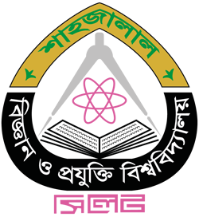
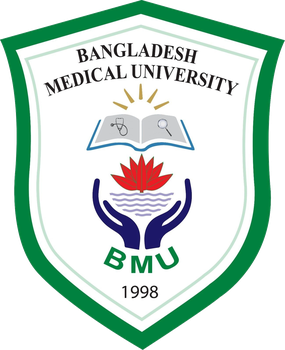
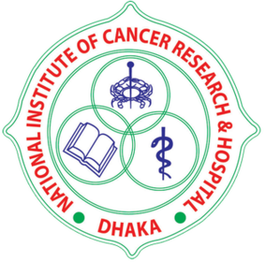
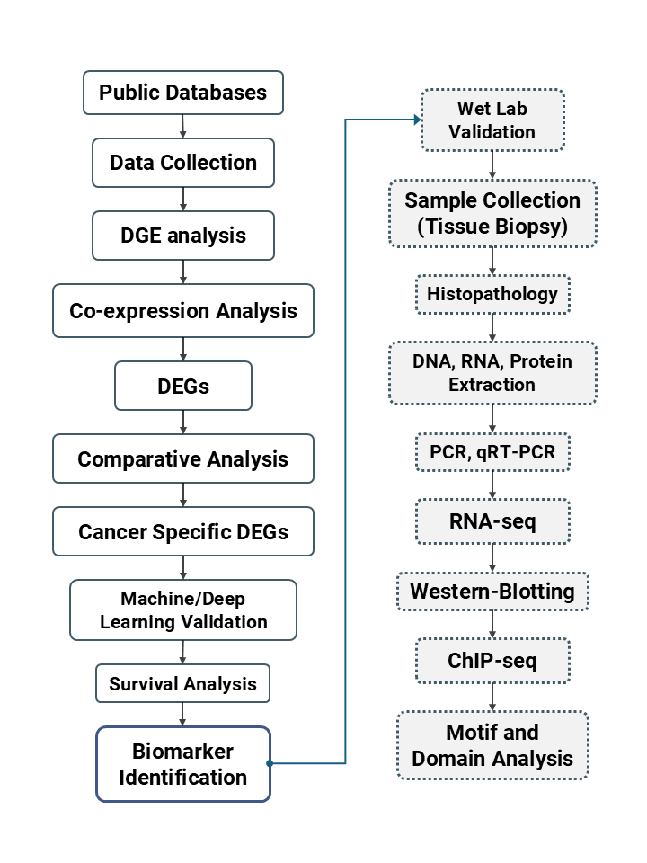

**Full title:** Machine Learning-Driven Identification and Quantitative Validation of Cancer-Specific Biomarkers across Multiple Carcinomas of Different Anatomic Sites

## Collaborating institutions

  
  
  

- **Bangladesh Medical University (BMU):** Department of Virology (lead), Gynecological Oncology, Otolaryngology–Head & Neck Surgery, Surgical Oncology, and Pathology
- **Shahjalal University of Science and Technology (SUST):** Department of Biochemistry and Molecular Biology (lead)
- **National Institute of Cancer Research & Hospital (NICRH):** Department of Surgical Oncology

## Abstract

**Background:** Early detection is critical for improving cancer prognosis, yet existing diagnostic biomarkers often lack adequate sensitivity and specificity. Advances in RNA sequencing, including single-cell RNA sequencing (scRNA-seq), have deepened our understanding of tumor heterogeneity. Computational pipelines can suggest potential biomarkers, but rigorous molecular validation is essential to confirm their clinical relevance.

**Methods:** The project integrates bioinformatic analyses with molecular validation. The dry-lab phase covers acquisition and analysis of RNA-seq and scRNA-seq datasets, differential gene expression profiling, and machine learning-based biomarker prioritization. The wet-lab phase validates candidates in human tissue samples. Histopathological examination ensures sample integrity, and DNA, RNA and protein extractions enable validation through qRT-PCR, PCR assays and ELISA. Bioinformatic tools then place validated biomarkers within their molecular pathways.

**Expected results:** A curated list of validated cancer-specific biomarkers, their expression profiles and associated molecular networks, along with key pathways underlying tumorigenesis across multiple anatomical sites.

**Conclusion:** By combining computational discovery with wet-lab validation, the study aims to establish highly sensitive and specific biomarkers for early cancer detection, contributing to precision oncology and better patient outcomes.

## Project design

## Research team

**Principal Investigator:** Dr. S. M. Rashed Ul Islam, Associate Professor, Department of Virology, BMU

**Co-Principal Investigator:** Tanvir Hossain, Department of Biochemistry and Molecular Biology, SUST

| Co-Investigator | Position | Department | Institution |
|---|---|---|---|
| Dr. Jannatul Ferdous | Professor | Gynecological Oncology | BMU |
| Dr. Syed Farhan Ali Razib | Associate Professor | Otolaryngology–Head & Neck Surgery | BMU |
| Dr. Hasan Shahrear Ahmed | Associate Professor | Surgical Oncology | BMU |
| Dr. Ashrafur Rahman | Assistant Professor | Surgical Oncology | NICRH |
| Dr. Bishnu Pada Dey | Associate Professor | Pathology | BMU |
| Papia Rahman | Lecturer | Biochemistry and Molecular Biology | SUST |

## Collaboration and ethics

- **Collaboration:** a joint project between BMU and SUST, with active participation from multiple clinical and research departments.
- **Ethical clearance:** approved by the Institutional Review Boards of both BMU and SUST.
- **MoU:** signed between the collaborating institutions to share resources and responsibilities.
- **Sample collection:** ongoing. Cancer-positive samples are being collected through the partner clinical departments for molecular validation.
